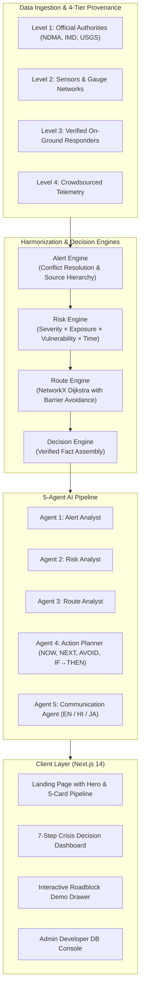
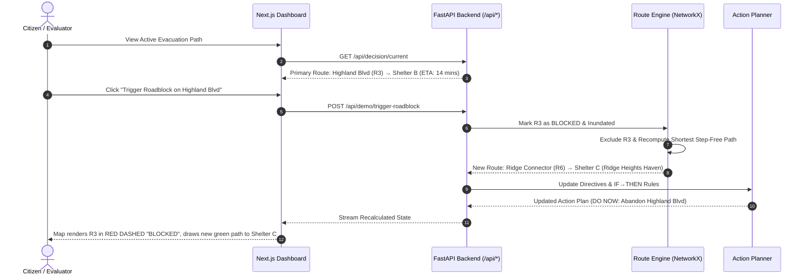

# ACT — Actionable Crisis Translator (v1.1.0)

> **"Turn emergency information into clear personal decisions."**

[]()
[]()
[]()
[](LICENSE)
[-blueviolet.svg)]()

---

## 🚨 What is ACT?

**ACT (Actionable Crisis Translator)** is an AI-powered personalized emergency decision-support platform. It transforms official, technical disaster alerts into immediate, barrier-free survival directives tailored to individual mobility, transit modes, and family companions.

### Key Capabilities:
- **Decision Intelligence Pipeline**: 5-stage transformation (`01 ALERT` → `02 RISK` → `03 ACTION` → `04 ROUTE` → `05 SHELTER`).
- **6 Supported Emergency Hazards**: Flood, Wildfire, Cyclone, Earthquake, Extreme Heat, and Urban Emergency.
- **Dynamic Roadblock Rerouting**: Instant recalculation when roads or bridges flood, automatically redirecting from primary safe haven (`Shelter B`) to secondary safe haven (`Shelter C`).
- **4-Tier Source Hierarchy**: Level 1 Official (NDMA, IMD, USGS) > Level 2 Infrastructure & Sensors > Level 3 Responders > Level 4 Crowdsourced.
- **Zero-Hallucination Guarantee**: Strict deterministic engine execution. Missing or unverified data triggers conservative shelter-in-place directives and `"Information unavailable."`
- **Accessibility-First Routing**: Specialized graph traversal guaranteeing step-free paths for wheelchair users and limited mobility citizens.
- **Multilingual Support**: Real-time localization across English (`en`), Hindi (`hi`), and Japanese (`ja`).
- **Theme Support**: Seamless Light, Dark, and System (`☀️ 🌙 💻`) modes.

---

## 🏗️ System Architecture & Data Flow



---

## 🔁 Killer Demo: Dynamic Roadblock Recalculation



---

## 📋 Standard Enterprise API Contracts (`/api/*`)

| Method | Endpoint | Description |
| :--- | :--- | :--- |
| `GET` | `/health` / `/api/health` | System health, service status, and environment mode |
| `GET` | `/api/decision/current` | Complete unified decision package (alert, risk, plan, route, shelters) |
| `POST` | `/api/demo/trigger-roadblock` | Simulates road flood on R3; recalculates route to Shelter C |
| `POST` | `/api/demo/reset` | Resets simulation to initial state (Shelter B) |
| `GET` | `/api/admin/sources` | 4-Tier Source Hierarchy definitions and trust weights |
| `GET` | `/api/routes/shelters` | Registry of shelters, open capacities, and accessibility |
| `GET` | `/api/routes/roads` | Real-time road network segments, risk levels, and blockages |
| `POST` | `/api/routes/recalculate` | Dynamic on-demand evacuation route calculation |
| `POST` | `/api/risk/calculate` | Personalized multi-factor risk assessment (0–100 score) |
| `POST` | `/api/plan/generate` | Generates verified DO NOW, NEXT, AVOID, and IF→THEN actions |
| `POST` | `/api/auth/register` | Citizen / responder account registration with mobility preferences |
| `POST` | `/api/auth/login` | JWT token authentication |
| `GET` | `/api/auth/me` | Current authenticated profile and RBAC permissions |

---

## 🧪 Verification & Automated Tests (35 / 35 Passed)

Run the full backend test suite:
```powershell
cd backend
pytest -v
```

### Verified Test Suites:
- `test_api_v1.py` — Enterprise `/api/*` endpoints, source conflict resolution, multi-emergency coverage, fail-safe rules.
- `test_api_endpoints.py` — Health contracts, simulation triggers, and plan generation.
- `test_agents_and_pipeline.py` — 5-agent pipeline synthesis and zero-hallucination guard.
- `test_alert_engine.py` — Alert ingestion, spatial exposure calculation, and CAP validation.
- `test_risk_engine.py` — Multi-hazard risk scoring and mobility vulnerability weights.
- `test_route_engine.py` — Dijkstra graph pathfinding, wheelchair stairs avoidance, and roadblock detour.
- `test_auth_and_rbac.py` — JWT authentication, password hashing, and 403 Forbidden admin protection.
- `test_database_persistence.py` — SQLAlchemy DB schema creation and seeding.

---

## 🚀 Local Quickstart Guide

### Prerequisites
- Python 3.10+ (Tested on Python 3.14)
- Node.js 18+ & npm

### 1. Start the Backend API
```powershell
cd C:\Projects\act\backend
python -m uvicorn app.main:app --reload --port 8000
```
- API Base URL: `http://localhost:8000`
- Interactive Swagger Docs: `http://localhost:8000/docs`
- Health Endpoint: `http://localhost:8000/api/health`

### 2. Start the Frontend Dashboard
```powershell
cd C:\Projects\act\frontend
npm run dev
```
- Open `http://localhost:3000` in your browser.
- Production build: `npm run build` followed by `npm start`.

---

## 📱 User Interface Progression

1. **Home / Landing Page**: Brand header, hero badge, headline, CTAs, 5-card decision intelligence pipeline, methodology, capabilities, safety and trust guarantee.
2. **Dashboard**: 7-Step crisis decision journey:
   - Step 1: Current Emergency Status
   - Step 2: Personalized Risk Score
   - Step 3: What You Should Do Now (Priority Actions)
   - Step 4: Safe Evacuation Route & Tactical Map
   - Step 5: Designated Safe Haven
   - Step 6: Live Updates & Recalculation Timeline
   - Step 7: Active Personal Settings & Consent
3. **Simulation Controls**: Collapsible top drawer to trigger instant roadblocks, adjust mobility preferences, and test multi-hazard responses.

---

## 🛡️ License

This project is licensed under the MIT License - see the [LICENSE](LICENSE) file for details.