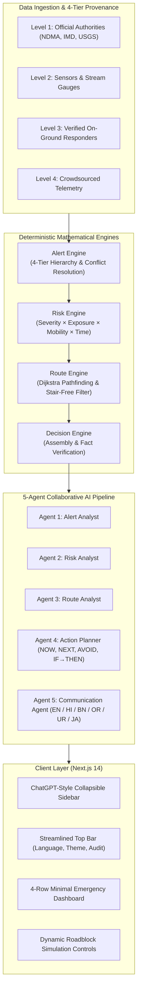

# ACT — Actionable Crisis Translator (v2.4.0)

> **"Turn emergency information into clear personal decisions."**

[]()
[]()
[]()
[](LICENSE)
[-blueviolet.svg)]()
[](./ACT_System_Documentation.pdf)

---

## 📄 Comprehensive PDF Documentation
A complete technical architecture specification, competitive benchmark analysis, and system documentation is available as a publication-ready PDF:
👉 **[Download ACT_System_Documentation.pdf](./ACT_System_Documentation.pdf)** or find it in [`docs/ACT_System_Documentation_and_Competitive_Analysis.pdf`](./docs/ACT_System_Documentation_and_Competitive_Analysis.pdf).

---

## 🚨 What is ACT?

**ACT (Actionable Crisis Translator)** is an autonomous, personalized emergency decision-support platform. It solves the **"Information Paradox"** in disaster management by translating technical, broadcast-level disaster alerts into immediate, step-free survival directives tailored to individual physical mobility, transport modes, and family companions.

### Key Capabilities & What Makes ACT Best & Unique:
- **Zero-Hallucination Deterministic Engine**: Mathematical rule engines govern all risk calculations, Dijkstra graph routing, and shelter capacity assignments. Generative AI is restricted to structured fact extraction and multilingual translation—preventing lethal hallucinations.
- **Dynamic Roadblock Rerouting**: When a road or bridge floods (e.g. Route C / Highland Blvd), ACT's event engine blacklists the corridor and automatically pivots to an alternative safe path and secondary shelter (`Shelter C - Highland Ridge`).
- **Accessibility-First Routing**: Specialized graph traversal strictly rejects stairs and enforces step-free ramps for wheelchair users and citizens with limited walking mobility.
- **Hyper-Personalized Risk Score**: $Risk = Severity (35\%) \times Exposure (25\%) \times Mobility (25\%) \times Time (15\%)$ producing a calibrated 0–100 score.
- **4-Tier Source Hierarchy**: Level 1 Official (NDMA, IMD, USGS) > Level 2 Sensor Mesh > Level 3 On-Ground Responders > Level 4 Crowdsourced Telemetry.
- **6 Native Languages with Voice Audio**: Instant linguistic switching between **English (`en`)**, **Hindi (`hi`)**, **Bengali (`bn`)**, **Odia (`or`)**, **Urdu (`ur`)**, and **Japanese (`ja`)**, with Web Speech API audio synthesis. Every single word across the UI translates dynamically.
- **ChatGPT-Style Collapsible Sidebar**: Modern AI workspace ergonomics featuring a collapsible/expandable sidebar with quick assessment actions, hazard badges, and bottom user card, paired with a minimal Top Bar and seamless Light/Dark theme switching.
- **Complete Offline Resiliency & Fail-Safe Mode**: Offline caching ensures usability during cellular outages. Missing telemetry triggers conservative vertical shelter-in-place directives.

---

## 📊 Competitive Benchmark: ACT vs Existing Systems

| Capability Dimension | Traditional SMS / TV | Google Public Alerts | FEMA Mobile App | Generic LLM (ChatGPT) | **ACT (This Platform)** |
| :--- | :--- | :--- | :--- | :--- | :--- |
| **Personalized Risk Score** | ❌ None (Broadcast) | ❌ Polygon only | ❌ Static checklist | ⚠️ Inconsistent guess | **✓ Formula-based (0–100)** |
| **Dynamic Roadblock Reroute** | ❌ None | ⚠️ Standard traffic | ❌ Static directory | ❌ No geospatial graph | **✓ Real-time corridor & haven pivot** |
| **Step-Free / Ramp Routing** | ❌ Ignored | ⚠️ Limited street view | ❌ Generic text | ❌ Hallucinates paths | **✓ Guaranteed stair-free validation** |
| **Hallucination Prevention** | ✓ Official text | ✓ Official feeds | ✓ Static content | ❌ Dangerous confabulation | **✓ Zero-Hallucination Engine** |
| **Action Plan Directives** | ❌ Unstructured | ⚠️ Long paragraphs | ⚠️ Static advice | ⚠️ Verbose prose | **✓ DO NOW, NEXT, AVOID + TTS Audio** |
| **Live Shelter Balancing** | ❌ No telemetry | ⚠️ External link | ⚠️ Static directory | ❌ No database state | **✓ Live capacity & slot tracking** |
| **Offline Reliability** | ✓ SMS offline | ❌ Needs web | ⚠️ Cached guides | ❌ Needs cloud API | **✓ Full offline cache + fail-safe** |
| **Linguistic Localization** | ⚠️ 1–2 languages | ✓ Auto-translate | ⚠️ EN / ES only | ✓ Multi-language | **✓ 6 Native Langs (Odia, Bengali...)** |
| **UI Design & Ergonomics** | ❌ Plain text | ⚠️ Search card | ⚠️ Form tabs | ✓ Conversational | **✓ ChatGPT Sidebar + Light/Dark** |

---

## 🏗️ System Architecture & 5-Agent Pipeline



---

## 🚀 How to Run the Project Locally

### 1. Start the Backend API (FastAPI)
```powershell
cd C:\Projects\act\backend
python -m uvicorn app.main:app --host 0.0.0.0 --port 8000 --reload
```
- Interactive Swagger API Documentation: `http://localhost:8000/docs`
- Health check: `http://localhost:8000/api/health`

### 2. Start the Frontend Web Application (Next.js 14)
```powershell
cd C:\Projects\act\frontend
npm run dev
```
- Interactive Web App: `http://localhost:3000`

### 3. Run Automated Tests
```powershell
cd C:\Projects\act\backend
pytest -v
```
*Current test suite: **35 / 35 passed in 1.31s**.*

---

## 📦 GitHub Update & Push Commands

To commit and push all recent improvements (documentation, PDF, ChatGPT sidebar, multi-language engine) to GitHub:

```powershell
# 1. Navigate to the project directory
cd C:\Projects\act

# 2. Check the status of your branch
git status

# 3. Stage all modified and new files (including docs, PDF, components)
git add -A

# 4. Commit changes with a descriptive message
git commit -m "feat: complete system documentation, competitive benchmark PDF, ChatGPT sidebar, and multi-language engine"

# 5. Push commits to GitHub repository (origin/main)
git push origin main
```

*(Note: When prompted for credentials, use your GitHub username and Personal Access Token).*