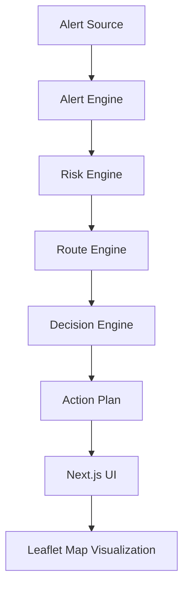
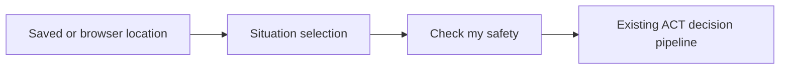

# ACT System Architecture

ACT separates decision logic from visual presentation. The backend remains the authoritative source for alerts, risk, route choice, shelter assignment, and simulation events, while the UI renders those facts for a user.

## System flow

The real-user dashboard adds this state flow before the decision view:

## Deterministic engines

The backend uses deterministic rule-based engines rather than a browser-side route planner:

- Alert engine: ranks source provenance and confirms active hazard conditions
- Risk engine: calculates personal risk from severity, mobility, and exposure
- Route engine: applies graph pathfinding with accessibility and blockage filters
- Decision engine: assembles the recommended action and shelter plan

## Roadblock flow

The roadblock and recalculation flow is as follows:

Normal route → simulated roadblock → backend recalculation → updated route → map refresh

This is preserved through the simulation API and backend route engine. The frontend never calculates alternate routes independently.

## Frontend map layer

The frontend map uses Leaflet as a visualization layer only. It reads the backend state for:

- current user location
- shelter coordinates
- route geometry
- hazard circle geometry
- road statuses and blocked segments

This keeps ACT aligned with the backend source of truth and avoids duplicate routing logic.

The current seeded route graph has a defined geographic coverage area. When a browser location is outside that coverage, ACT preserves the location for risk and map context but returns an unavailable route rather than fabricating geometry.

## Fail-safe behavior

If geographic data is missing or insufficient, ACT does not fabricate coordinates. The system shows the safest available state, preserves the rest of the decision logic, and avoids inventing route geometry or shelter positions.

Selecting a situation without verified alert telemetry also enters this fail-safe path. The UI marks the information unavailable and directs the user to official emergency instructions.
