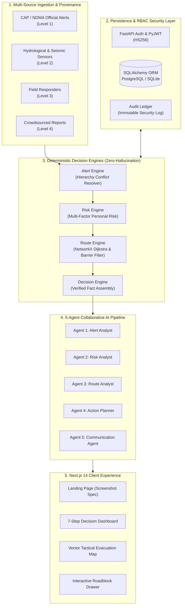
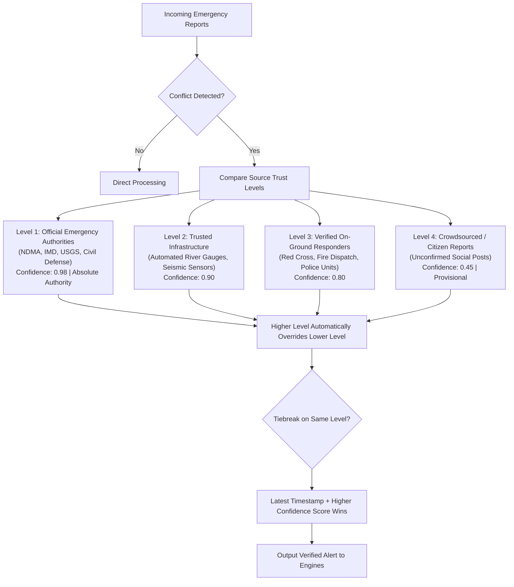
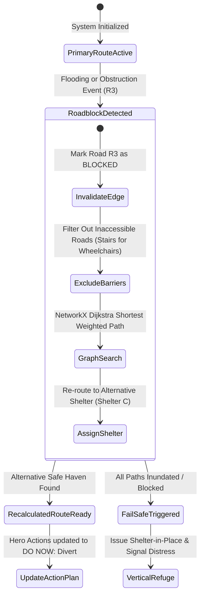

# ACT System Architecture & Engineering Design (v1.1.0)

> **Actionable Crisis Translator — Emergency Decision-Support Platform**

---

## 1. High-Level System Architecture

ACT follows a strict decoupling between **Data Ingestion**, **Deterministic Rule Engines**, an **Agentic Decision Pipeline**, and a **Reactive Web Client**.

---

## 2. 4-Tier Source Hierarchy & Conflict Resolution

Emergency situations frequently suffer from conflicting alerts (e.g., social media reports claiming water has receded while civil defense has ordered an evacuation). ACT resolves this using a strict trust priority ladder:

---

## 3. Dynamic Roadblock & Route Recalculation Flow

When an active evacuation route becomes obstructed (e.g., flash flood inundating Highland Boulevard), ACT executes instant real-time graph recalculation without application crashes:

---

## 4. Multi-Emergency Risk Model

The prototype decision-support score is calculated transparently using an explainable multi-factor formula:

$$\text{Composite Score} = (0.35 \times S) + (0.25 \times E) + (0.25 \times V) + (0.15 \times T)$$

Where:
- **$S$ (Severity Factor)**: Extreme ($1.0$), High ($0.85$), Medium ($0.50$), Low ($0.25$).
- **$E$ (Exposure Factor)**: Haversine distance from epicenter vs hazard radius. Conservative fallback ($0.60$) if spatial boundaries are unverified.
- **$V$ (Vulnerability Factor)**:
  - Mobility: Wheelchair ($0.95$), Limited Walking ($0.80$), Normal ($0.50$).
  - Transport: Walking ($0.85$), Bicycle ($0.65$), Transit ($0.60$), Car ($0.40$).
  - Hazard Modifiers: Inhalation risk in Wildfire ($+0.10$), Heat stress in Extreme Heat ($+0.12$), High wind exposure in Cyclone ($+0.10$).
- **$T$ (Time Pressure Factor)**: Time to impact remaining ($<15$ mins = $1.0$, $<30$ mins = $0.85$, etc.).

---

## 5. Fail-Safe Missing Information Handling

In accordance with strict life-safety design guidelines:
1. **Never Hallucinate**: If road network data, shelter status, or GPS telemetry is unavailable, ACT explicitly displays `"Information unavailable."` and sets `failsafe_status="⚠️ INSUFFICIENT INFORMATION"`.
2. **Defensive Guidance**: When no safe ground route can be mathematically guaranteed, the platform instructs citizens to cease lowland transit, seek upper-level vertical refuge inside the nearest sturdy building, and signal distress to official responders.